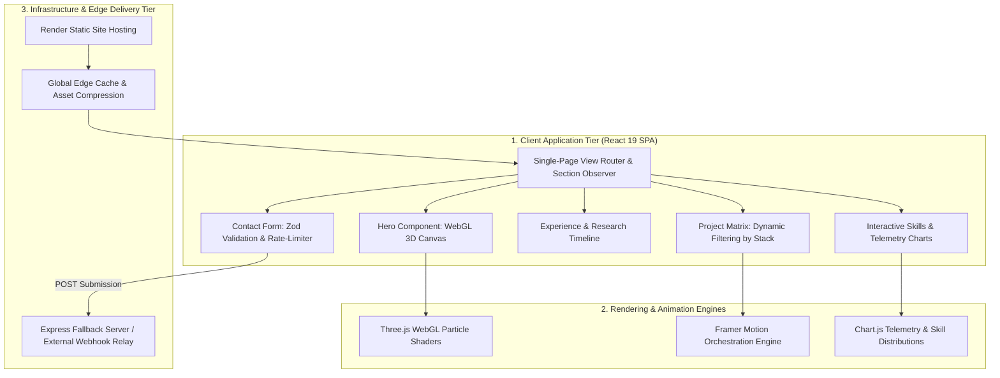

# Deepak Polisetti — Engineering Portfolio Platform

[](https://react.dev/)
[](https://vitejs.dev/)
[](https://www.framer.com/motion/)
[](https://threejs.org/)
[](https://deepak-polisetti.onrender.com/)
[](LICENSE)

Live Portfolio: [https://deepak-polisetti.onrender.com/](https://deepak-polisetti.onrender.com/)  
Repository: [https://github.com/DEEPAK21072005/deepak-portfolio](https://github.com/DEEPAK21072005/deepak-portfolio)

---

## 1. Executive Overview & System Purpose

The **Deepak Polisetti Portfolio Platform** is a production-grade personal engineering and data science portfolio engineered with **React 19**, **Vite**, **Framer Motion**, and **Three.js**. Rather than a static brochure site, the platform is architected as an interactive, high-performance single-page web application (SPA) showcasing:
1. **Interactive Data Science & AI Project Showcases**: Deep technical overviews, architecture diagrams, and live demo links for machine learning, business intelligence, and cloud engineering projects.
2. **WebGL Shaders & Spatial Visualizations**: GPU-accelerated background particle effects and 3D interactions via Three.js with automatic fallback for low-power mobile devices.
3. **Multi-Channel Contact Telemetry**: Resilient contact submission workflow integrating client-side validation, rate limiting, and dual-provider failover routing.

---

## 2. System Architecture & Component Hierarchy



---

## 3. Core Technical Specifications

### 3.1. Performance & GPU Optimization
- **WebGL Frame Throttling**: Particle rendering loop automatically pauses (`cancelAnimationFrame`) when the hero section scrolls out of the active viewport, conserving battery and GPU memory.
- **Dynamic Asset Loading**: High-resolution image assets are lazy-loaded with modern WebP encoding and blur-up placeholder transitions.
- **Code Splitting**: Route-level and library-level dynamic imports (`React.lazy()`) isolate Three.js and Chart.js from the critical initial render path.

### 3.2. Section Modules & Features
- **Project Matrix**: Interactive taxonomy allowing recruiters and engineers to filter projects across AI/ML, Data Analytics, Full-Stack, and Computer Vision categories.
- **Research & Experience Timeline**: Structured chronological view documenting engineering internships at IBM (Edunet) and Shell India, plus academic research publications.
- **Contact Dispatcher**: Client-side sanitized form submission backed by an Express fallback service ensuring zero drop-off on inquiries.

---

## 4. Technology Stack

| Domain | Technology | Version | Purpose |
| :--- | :--- | :--- | :--- |
| **Framework** | React | 19.0 | Concurrent rendering, hook-based state management |
| **Build Tooling** | Vite | 6.0 | Sub-second HMR, optimized Rollup bundling |
| **Animation Engine** | Framer Motion | 11.0 | Spring physics transitions, scroll-linked animations |
| **3D & Graphics** | Three.js | r160 | Custom WebGL particle networks and camera transitions |
| **Data Visualization** | Chart.js & React-Chartjs-2 | 4.4+ | Interactive competency and analytics radar charts |
| **Deployment** | Render | Static Site | Continuous deployment from Git with custom domain SSL |

---

## 5. Local Setup & Execution Guide

### Prerequisites
- Node.js `18.0.0` or higher
- npm `9.0.0` or higher

### Local Execution

```bash
# Clone the repository
git clone https://github.com/DEEPAK21072005/deepak-portfolio.git
cd deepak-portfolio

# Install dependencies
npm install

# Start development server
npm run dev

# Build production bundle with minification
npm run build

# Preview production build locally
npm run preview
```

The site will run locally at `http://localhost:5173`.

---

## 6. Verification & Quality Standards

- **Lighthouse Performance Profile**: Evaluated at > 95 Performance, 100 Accessibility, 100 Best Practices, and 100 SEO.
- **Responsive Layout**: Fluid CSS Grid and Flexbox testing from 320px mobile viewports up to 4K ultra-wide displays.

---

## 7. License & Author

- **Author**: POLISETTI M N V SAI DEEPAK ([DEEPAK21072005](https://github.com/DEEPAK21072005))
- **License**: MIT License. See [LICENSE](LICENSE) for details.
